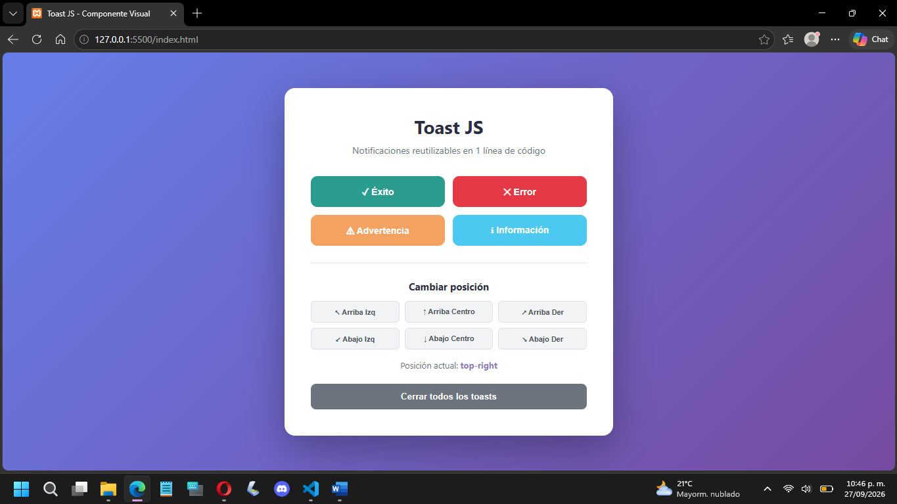
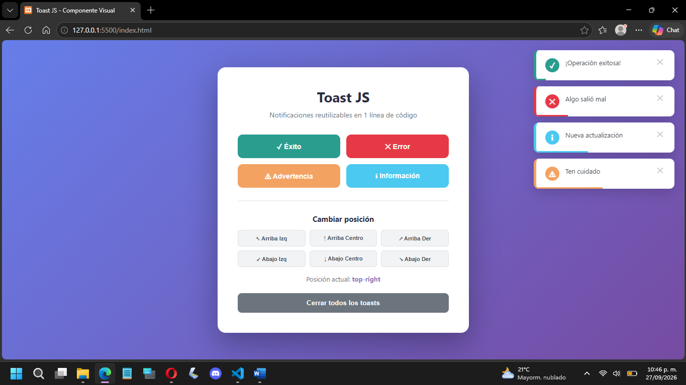
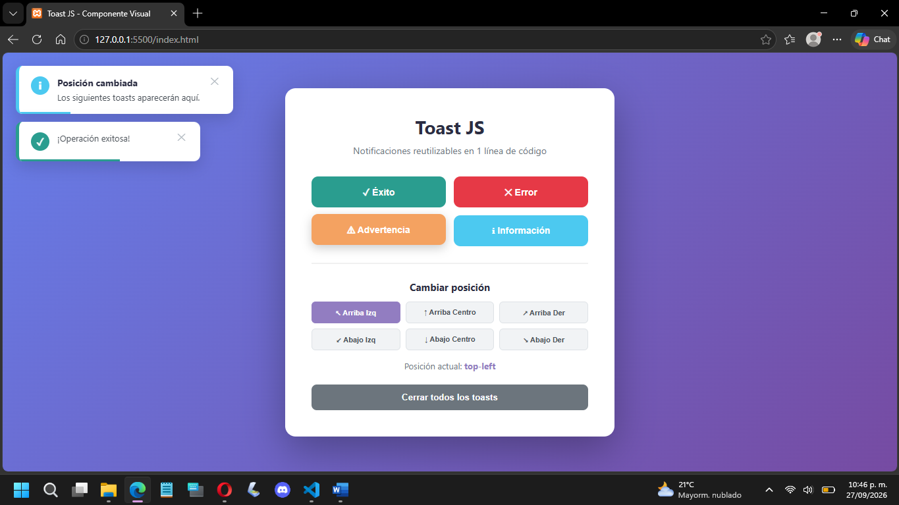
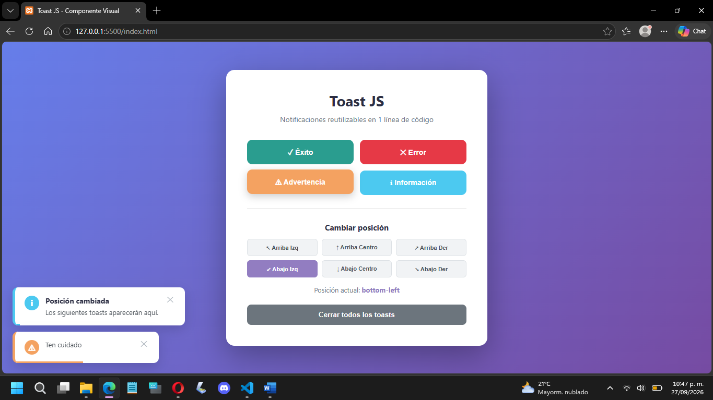
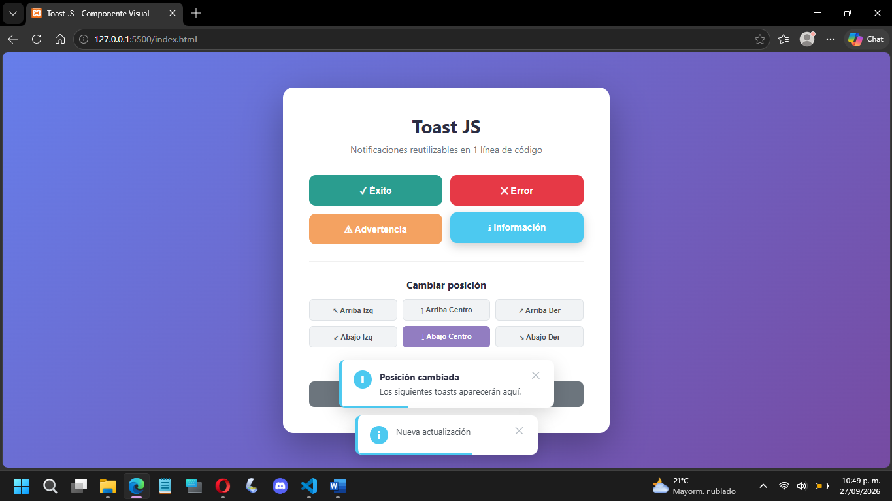
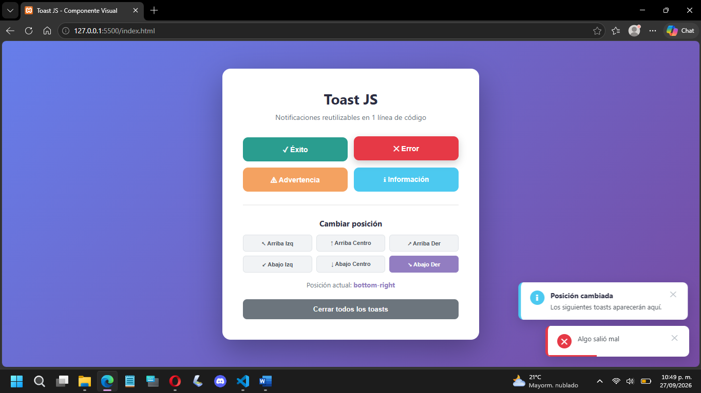
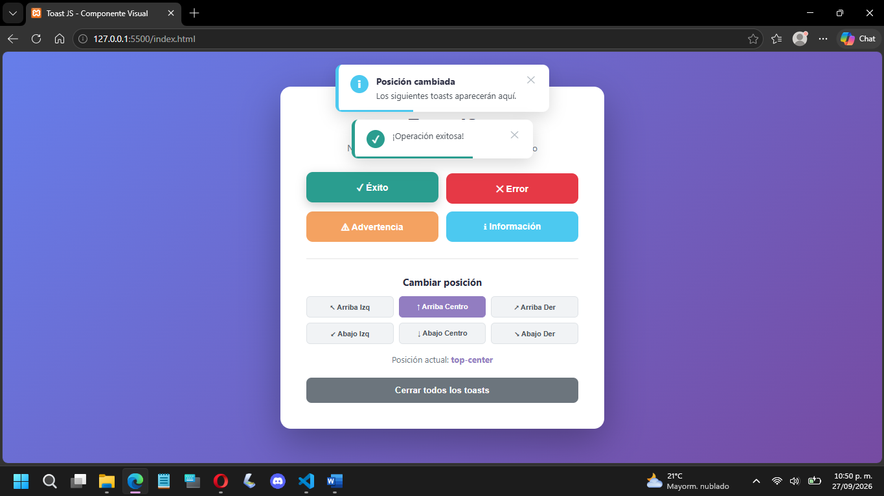

# 🍞 Toast JS

**Autor:** Perla Danae Gallardo Vasquez 
**Materia:** Programación Web  
**Repositorio:** [https://github.com/PerlaD391/ComponenteVisual](https://github.com/PerlaD391/ComponenteVisual)  
**Demo en vivo:** [https://perlad391.github.io/ComponenteVisual/](https://perlad391.github.io/ComponenteVisual/)

---

## 🎯 ¿Qué problema resuelve?

**Toast JS** es un componente visual reutilizable de **notificaciones tipo toast** (esas ventanas pequeñas que aparecen en una esquina de la pantalla para avisar algo al usuario).

### El problema:
En la mayoría de los proyectos web, cuando quieres mostrar una notificación al usuario (ej: "Guardado exitosamente", "Error al procesar"), terminas escribiendo **HTML, CSS y JavaScript desde cero** cada vez. Esto genera:
- ❌ Código duplicado
- ❌ Inconsistencia visual
- ❌ Pérdida de tiempo

### La solución:
**Toast JS** te permite mostrar notificaciones profesionales con **una sola línea de código**:

```javascript
Toast.exito('¡Guardado exitosamente!');
```

Sin frameworks, sin dependencias, sin complicaciones.

---

## 📦 Instalación

### Paso 1: Incluye el CSS en tu HTML

```html
<link rel="stylesheet" href="css/componente.css">
```

### Paso 2: Incluye el JS antes de cerrar el `</body>`

```html
<script src="js/componente.js"></script>
```

### Paso 3: ¡Listo para usar!

```javascript
Toast.exito('¡Funciona!');
```

---

## 🚀 Uso con ejemplos de código

### 1. Toast de éxito

```javascript
Toast.exito('¡Guardado exitosamente!');
```

### 2. Toast de error

```javascript
Toast.error('No se pudo conectar al servidor');
```

### 3. Toast de advertencia

```javascript
Toast.advertencia('Tu sesión expirará en 5 minutos');
```

### 4. Toast de información

```javascript
Toast.info('Hay una nueva versión disponible');
```

### 5. Toast personalizado con todas las opciones

```javascript
Toast.mostrar({
    tipo: 'success',
    titulo: '¡Registro completado!',
    mensaje: 'Tu cuenta ha sido creada exitosamente.',
    posicion: 'top-right',
    duracion: 5000,
    cerrable: true,
    mostrarProgreso: true
});
```

### 6. Cambiar la posición por defecto

```javascript
// Cambia la posición para los siguientes toasts
Toast.setPosicion('bottom-left');

// Ahora todos los toasts aparecerán abajo a la izquierda
Toast.exito('Este toast aparecerá abajo a la izquierda');
Toast.error('Este también');
```

### 7. Consultar la posición actual

```javascript
console.log(Toast.getPosicion());  // "bottom-left"
```

### 8. Cerrar todos los toasts

```javascript
Toast.cerrarTodos();
```

---

## 🎨 Opciones disponibles

| Opción | Tipo | Por defecto | Descripción |
|:---|:---|:---|:---|
| `tipo` | string | `'info'` | `'success'`, `'error'`, `'warning'`, `'info'` |
| `titulo` | string | `''` | Título opcional en negrita |
| `mensaje` | string | (requerido) | Texto del toast |
| `posicion` | string | (la actual) | `top-left`, `top-center`, `top-right`, `bottom-left`, `bottom-center`, `bottom-right` |
| `duracion` | number | `3000` | Milisegundos visible (0 = permanente) |
| `cerrable` | boolean | `true` | Muestra botón de cerrar |
| `mostrarProgreso` | boolean | `true` | Muestra barra de progreso |

---

## 📸 Capturas de pantalla

### Captura 1:


### Captura 2:


### Captura 3: 


### Captura 4: 


### Captura 5: 


### Captura 6: 


### Captura 7: 


---

## 🎥 Video demo

[Ver video en YouTube](https://youtu.be/TU-VIDEO-AQUI)

---

## 📁 Estructura del repositorio

```
/componente-visual
├── README.md
├── index.html
├── /css
│   └── componente.css
├── /js
│   └── componente.js
└── /img
    ├── captura1.png
    ├── captura2.png
    ├── captura3.png
    └── captura4.png
```

---

## 📋 API pública

| Método | Descripción |
|:---|:---|
| `Toast.mostrar(opciones)` | Muestra un toast con opciones personalizadas |
| `Toast.exito(mensaje, opciones)` | Atajo para toast de éxito |
| `Toast.error(mensaje, opciones)` | Atajo para toast de error |
| `Toast.advertencia(mensaje, opciones)` | Atajo para toast de advertencia |
| `Toast.info(mensaje, opciones)` | Atajo para toast de información |
| `Toast.setPosicion(posicion)` | Cambia la posición por defecto |
| `Toast.getPosicion()` | Devuelve la posición actual |
| `Toast.cerrar(toast)` | Cierra un toast específico |
| `Toast.cerrarTodos()` | Cierra todos los toasts |

---

## 📜 Licencia

Este proyecto es de uso libre para fines académicos y personales.

---

## 👤 Autor

**Perla Danae Gallardo Vasquez**  
Estudiante de Ingenieria en Sistemas Computacionales  
21160634@itoaxaca.edu.mx

---

⭐ **Si te gustó este componente, dale una estrella en GitHub** ⭐
